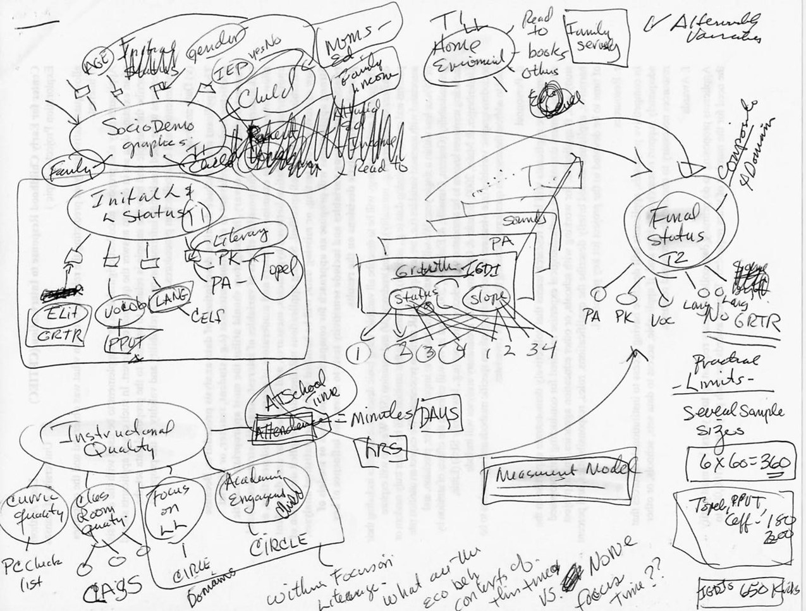
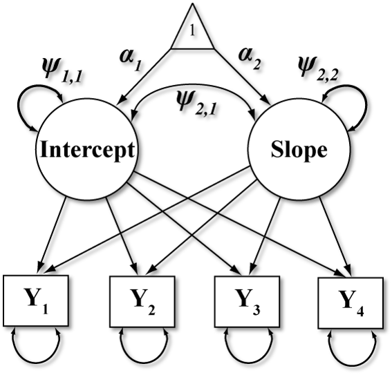
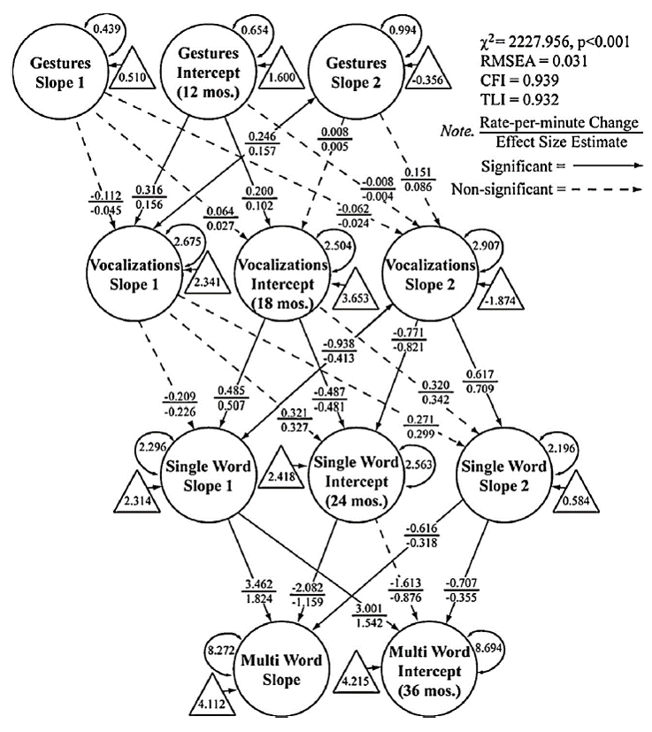
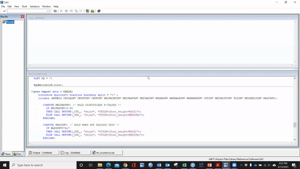
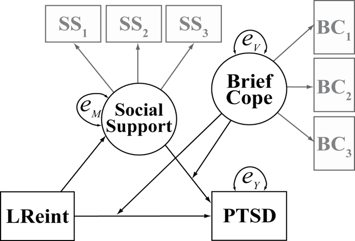
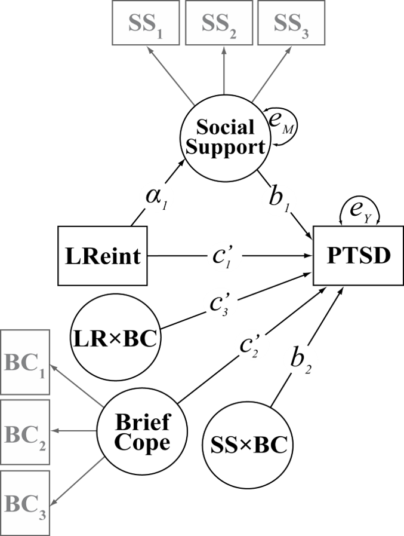
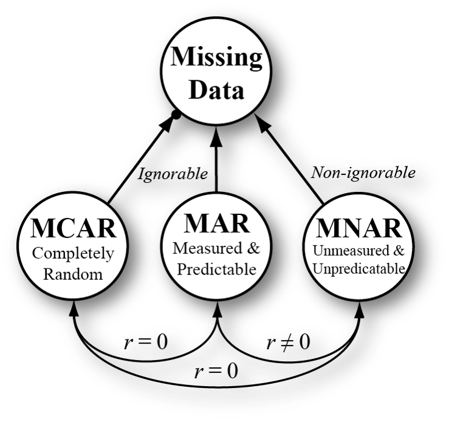
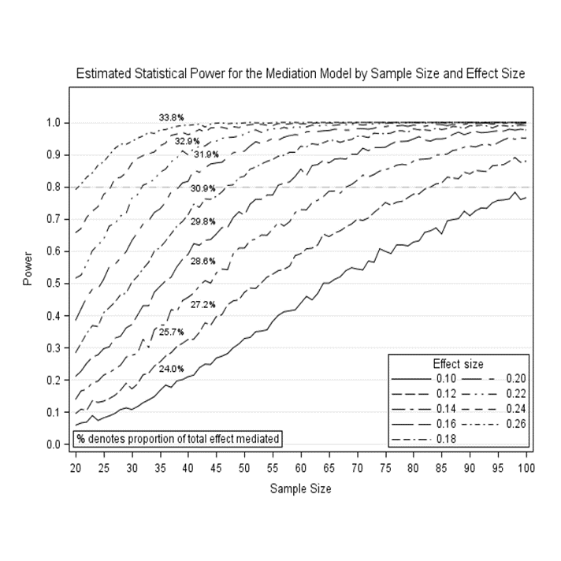

```{r include=FALSE, purl=TRUE}
# specify the packages of interest
pkgs <- c(
  "tidyverse", "moderndive", "dslabs",
  "infer", "janitor", "remotes", "knitr",
  "usethis"
)

# use this function to check if each package is on the local machine
# if a package is installed, it will be loaded
# if any are not, the missing package(s) will be installed and loaded
pkg_check <- function(x) {
  if (!require(x, character.only = TRUE)) {
    install.packages(x, dependencies = TRUE, repos = "https://cran.rstudio.com")
    library(x, character.only = TRUE)
  }
}
lapply(pkgs, pkg_check)

if (!require("fontawesome")) {
  remotes::install_github("rstudio/fontawesome")
}

if (!require("countdown")) {
  remotes::install_github("gadenbuie/countdown")
}

```

```{r echo=FALSE, purl=FALSE}
library(ggplot2)
knitr::opts_chunk$set(
  warning = FALSE, message = FALSE, 
  fig.width = 10.5, fig.height = 4, 
  comment = NA, rows.print = 16
)
theme_set(theme_gray(base_size = 24))
options(digits = 5, width = 65, knitr.table.format = "html",
        pillar.min_chars = 20, tibble.print_min = 5)
library(fontawesome)

img_link <- function(link, file, size) {
  knitr::asis_output(
    paste0(
      '<center>\n<a href="',
      link,
      '">\n\n</a>\n</center>'
    )
  )
}

library(dplyr)
library(biosketchr)
library(scholar)

myid <- "wUACzXkAAAAJ&hl"
cites<-get_citation_history(myid)
ncites<-sum(cites$cites)

hindex <- predict_h_index(myid)
nhindex <- hindex$h_index[hindex$years_ahead==0]

l <- get_profile(myid)
i10index <- l$i10_index

njournals <- get_num_distinct_journals(myid)

```

class: middle, center

# Thinking About and Approaching Statistics

## Waylon Howard, PhD

`r knitr::include_graphics("images/openhealth.png", dpi = 275)`

### Slides available at <http://tinyurl.com/pharmerit-slides> 

### PDF slides at <http://tinyurl.com/pharmerit-pdf>

???

Welcome to our session! My name is Waylon Howard. Before we begin please note that you can find the link to the HTML version of my slides as well as the PDF version here. I'd like to start with an introduction.

---

name: my-info
class: middle

<h5></h5>

.pull-left[
  
  
  <small>Global Director of Biostatistics </small> <br>
  <small>and Data Analytics</small> <br>
  <br>
  

  <br>

  [`r fa(name = "linkedin")` @waylon-howard](https://www.linkedin.com/in/waylon-howard/)  
  [`r fa(name = "github")` @wwwaylon](https://github.com/wwwaylon)  
  [`r fa(name = "link")` wwwaylon.github.io](https://wwwaylon.github.io/)  
<!--  [`r fa(name = "paper-plane")` `wwwaylon [at] gmail [dot] com`](mailto:wwwaylon@gmail.com) -->
]

.pull-right[

  <medium>Education</medium>
  <br>
    <small>Ph.D., Quantitative Psychology</small>
  <small>University of Kansas (2012); Advisor: [Todd D. Little](https://scholar.google.com/citations?user=T-dKKGkAAAAJ&hl=en)</small>
  <br><br>

  <medium>Currently</medium>
  <br>
<small>Lead a [10-person](https://www.concertai.com/) team</small>    
<small>Oncology focused RWE analytics</small>     
- <small>[Clinical: EMR curation](https://www.concertai.com/)</small>     
- <small>[Humanistic: PRO data]()</small>     
- <small>[Economic: claims]()</small>      

<small>[SymphonyAI](https://www.prweb.com/releases/2018/06/prweb15527516.htm) acquisition</small>     
- <small>[More than 60%](https://www.concertai.com/) growth</small>   
- <small>Developed [15+ SOP, WI, GD]()</small>   

]

???
Originally trained as a Quantitative Psychologist, I have studied applied statistics and research methodology for over 10 years, and gone on to develop advanced expertise in the application and advancement of quantitative measurement and analysis practices within the social, behavioral, and health sciences. My research interests include modeling individual, group, and developmental differences, general structural equations modeling techniques, construct validation, measurement, and missing data analysis. 

Currently, I lead biostatistics for ConcertAI. I'm based in Seattle, WA and have staff of 10 MS-level analysts across the US and in India. 

Our mission is to provide ConcertAI with responsive, efficient, and high quality analytical support. We assume a leadership role as we collaborate with investigators and clients across all phases of their research. 

QQQ about data

---

name: toc
  
# Table of Contents

- [Research and Leadership](#my-work)    
<br>
- [Motivating example](#mot-exa)    
<br>
- [Modern modeling highlights](#high)    
<br>
- [Summary](#value)

???
The first part of the presentation is focused on General overview of experience in quantitative statistical analysis and interests including a recent experience with a challenging or innovative data and the second part is about add value as part of PCO and RWE teams based on the experience highlighted in the first part.
---

layout: true

<div class="my-footer"><span>Slides at http://tinyurl.com/pharmerit-slides &emsp; &emsp; &emsp; &emsp; &emsp; &emsp; &emsp; &emsp; &emsp; Return to <u><a style="color:White;" href="slide_deck.html#toc">Table of Contents</a></u></span></div>

---

name:my-work

## Interdisciplinary-oriented collaborator


 
--

***
<br>
My work has appeared in [**`r njournals`**](https://scholar.google.com/citations?user=wUACzXkAAAAJ&hl=en) different peer-reviewed journals garnering [**`r ncites`**](https://scholar.google.com/citations?user=wUACzXkAAAAJ&hl=en) citations, with an h-index of [**`r nhindex`**](https://scholar.google.com/citations?user=wUACzXkAAAAJ&hl=en) and an i-10 index of [**`r i10index`**](https://scholar.google.com/citations?user=wUACzXkAAAAJ&hl=en). <br><br>

???
A researcher's vision is often constrained by how they think about and use data.
It is tough to watch researchers develop intricate theories about how the world works, which represent a lot of deep thinking about a topic, only to cut them up into smaller chunks that are then crammed into canned statistical procedures that were never designed to address the original question to begin with.
Methodological advances allow us to ask more sophisticated questions. But how do researchers stay current with advances in methodology and data analysis?

I love to dig into all phases of research projects - from planning to publication. I work to identify and outline investment to build and maintain research capacity by providing responsive, efficient, and high-quality analytical support.
My work includes multivariate approaches to measurement and analysis of substantive problems where I have led simulation-based research and contributed to recommendations for applied researchers. In addition, I have conducted substantive research using structural equation modeling techniques as a general data analytic approach to studying individual, developmental, and socio-contextual differences within the social, behavioral, and health sciences. I also have extensive grant experience in relation to study design, statistical analytic plans and power analyses. 

I have enjoyed many leadership positions throughout my career and believe that personal and professional relationships form the backbone of all sustainability and growth, and that a reflective focus on continuous improvement data informs good decision making.
I look forward to discussing 
 

---

name:my-work

## Grants and contracts

I have directly collaborated with researchers to attain [**more than $5 million**](https://orcid.org/0000-0002-0355-2244) in new research funding and developed considerable experience applying diverse best-practice methods to complex problems in new areas.

???

--

***

## Training

Organized, managed, and taught an 8-course advanced methodology workshop for faculty and graduate students (N = 60) and a 6-course basic methodology training series for residents (N = 150).

<!--
These slides were built using

```{r}
R.version.string
```

```{r}
rstudioapi::versionInfo()$version
```
-->

<br>

```{r, eval=FALSE, purl=FALSE, include=FALSE}
pkgs <- c(
  "tidyverse", "moderndive", "dslabs", 
  "infer", "janitor", "usethis"
  )
install.packages(pkgs)
```

???
I have created and taught in training conferences. 

---

## Mentoring

The coalescence of a new vision for team leadership within the organization that resulted in new funding, partnerships, and additional value offered by the team. 

???
I have enjoyed many leadership positions throughout my career and believe that personal and professional relationships form the backbone of all sustainability and growth, and that a reflective focus on continuous improvement data informs good decision making. My mission as a leader is to support staff and systems to achieve sustainable growth in services, funding, staff/faculty satisfaction, and strategic partnerships. To accomplish this, I focus on a number of critical leadership effectiveness efforts including: strategic planning, productivity and quality, funding and partnerships, reflection, and mentoring.

--

***


???

---
layout: true

<div class="my-footer"><span>Slides at https://bit.ly/csp-tidy-slides &emsp; &emsp; &emsp; &emsp; &emsp; &emsp; &emsp; &emsp; &emsp; Return to <u><a style="color:White;" href="slide_deck.html#toc">Table of Contents</a></u></span></div>


---
class: middle, center

## Is this change *significant*?

--

## Different question: 

--

## Is this change *sustainable*?


---

### Remaining sustainable   

 
<br><br>

- Services billed increased by [38.6%]()    
- Team averaged [78.3%]() billable time    
- Compound annual growth rate [+9.2%]()

???

---

name:mot-exa

class: inverse, center, middle

# Motivating example


???

---


    
???
    Several years ago I worked as a quantitative methodologist for a large research center focused on how children develop and learn. One of the main ideas of this group was to translate social and developmental psychology theory into effective interventions to enhance social and academic outcomes.
  
  My primary area of research was the development and application of novel statistical methods to better translate the kind of benefits that we can get from a conceptual simulation study into real-world settings where the application is often not so good. We had to solve all kinds of methodological problems and technical limitations (e.g., missing data; see Howard, Rhemtulla & Little, 2015) in a research space where over-simplified data analytic practices persist for decades. I found that the application of advanced statistical methods, particularly within the structural equation modeling framework, were really interesting in this context and very challenging.
  
  One of our projects focused on progress monitoring of a new composite communication score to assess early language performance, quantify rates of development, and determine how individuals respond to intervention. What struck me was the enormous gap between the proposed statistical methods and the research questions.
  
  As a statistical consultant, I worked closely with the research team to focus on the theory. This is a path diagram drawn by the primary investigator from one of those meetings that demonstrates a deep theoretical vision for language development.
  
  I often get diagrams like this and I love to see them. What I want you to notice is that there is a lot going on here, we have multiple processes interacting in some really interesting ways. In this diagram you see the forest rather than the trees - which is to say that we are not focusing on one regression path or mean comparison here, rather we are looking into a complex system and all the effects are within the context of all the other pieces of the model.
  
---

class: center, middle

## First motivating example for today

```{r eci, echo=FALSE}
library(ggplot2)
library(gridExtra)
library(tidyverse)
library(gganimate)
library(directlabels)
library(png)
library(transformr)
library(grid)
library(magick)

eci <- read.csv(file = "images/eci_long.csv")
eci$Type <- factor(eci$Type, levels = c("Gestures", "Vocalizations", "Single Words", "Multiple Words"))

theme_Publication <- function(base_size=24, base_family="sans") {
  library(grid)
  library(ggthemes)
  (theme_foundation(base_size=base_size, base_family=base_family)
    + theme(plot.title = element_text(face = "bold",
                                      size = rel(1.2), hjust = 0.5),
            text = element_text(),
            panel.background = element_rect(colour = NA),
            plot.background = element_rect(colour = NA),
            panel.border = element_rect(colour = NA),
            axis.title = element_text(face = "bold",size = rel(1)),
            axis.title.y = element_text(angle=90,vjust =2),
            axis.title.x = element_text(vjust = -0.2),
            axis.text = element_text(), 
            axis.line = element_line(colour="black"),
            axis.ticks = element_line(),
            panel.grid.major = element_line(colour="#f0f0f0"),
            panel.grid.minor = element_blank(),
            legend.key = element_rect(colour = NA),
            legend.position = "none",
            legend.direction = "horizontal",
            legend.key.size= unit(0.2, "cm"),
            legend.margin = unit(0, "cm"),
            legend.title = element_text(face="italic"),
            plot.margin=unit(c(10,30,5,5),"mm"),
            strip.background=element_rect(colour="#f0f0f0",fill="#f0f0f0"),
            strip.text = element_text(face="bold")
    ))
  
}

p <-  
  ggplot(data = eci, aes(x= time, y=Rate, group=Type, colour=Type)) +
  geom_line(size=3.5, show.legend = FALSE) +
  ylab("Rate per Minute") + xlab("Time (in months)") + 
  scale_x_continuous(breaks = round(seq(min(eci$time), 54, by = 6), 1)) + 
  scale_y_continuous(breaks = round(seq(0, 6, by = 1), 2)) +
  theme_Publication() +
  geom_dl(aes(label=Type), method = list("last.points", cex = 2)) + 
  labs(title = 'ECI key skills at {frame_along} months') +
  coord_cartesian(clip = 'off') + 
  transition_reveal(time) +
  ease_aes('quadratic-in-out')

# Run animation  
animate(p, nframes=60, fps=5, width = 1200, height = 720, end_pause = 10, renderer = magick_renderer())

# Save animation
#anim_save("C:/Users/waylon/Desktop/csp-2021/images/eci.gif", animation = last_animation())

```

???

This is a plot of some data collected for this project.

Notice that each line represents a different form of communication - so the flat line is gesturing, the line above that is vocalizations, we also have single words and then multiple words. Look at how vocalizations seem to peak around 18 months then decline - also referencing this peak notice how the use of single words is accelerating. The idea here is that children transition from one communication strategy to another and this tool seems to capture it.

The question is how to get from data collection with this tool to evaluating the theory of change illustrated above. Traditional approaches might include the creation of multiple-item scale scores (e.g., sum all the communication scales into a total score that are tested using ANCOVA or multilevel modeling - but where is this indicated in the theoretical diagram above? Consider how focusing on one communication measure at a time (i.e., gestures, vocalizations, single- and multiple-word utterances) or an aggregate of all communication scores misses the point.

We wanted to identify inter-individual differences in intra-individual change in language development. Unlike traditional approaches latent growth curve modeling allowed for a more accurate and flexible approach to analyzing repeated measures data by simultaneously modeling change in the means (variable-centered) and in the variance and covariance of level and change (person-centered) across all forms of communication shown in the plot above - within the same model. This model allowed for testing of precursors and consequences of change and multiple group differences in these trajectories and predictive relationships.

Total communication is the weighted combination of the child's gestures (1 X each event), vocalizations (1 X each event), single-word (2 X each event) and multiple-word utterances (3 X each event). 


---

class: center, middle

# Exemplary LGM model

.pull-left[

<br>

[Path diagram](https://www.google.com) 
]

.pull-right[
<br><br>


<br><br>
<!-- New hex is fine here too -->

[Parameter illustration](https://www.statscamp.org/)
]

???
To address this challenge I used the Latent Growth Curve Modeling approach within the Structural Equation Modeling Framework.  

But Why did I go with the LGM over other possible approaches such as a repeated measures ANOVA, or even a multilevel model? 

LGM allowed for enormous flexibility in the specification of change over time which allowed for a better correspondence between the statistical model and the theory. 

RM-ANOVA and other variations of it model a group mean and treat variation as error - this was inconsistent with our goals because we wanted to actually model the individual differences. Both MLM and LGM allow us to examine intra-individual (within person) change over time AND inter-individual (between person) variability in intra-individual change because these are random effects models.

Notice the diagram on the bottom - each black line represents an individual person that can have their own intercept and slope. As you can see- some start higher, some lower, some increase, some decrease, some are flat. Well, we can determine the average starting point - denoted with a green dot here and also capture the variability around that average intercept. Similarly, we can estimate an average slope and variability around that slope. 

In the MLM approach, latent growth curve models are limited to a single growth curve, and the intercept and slope of a latent growth curve cannot predict other variables. This would again require that we change our theory to suit the statistical method - so this is not appropriate. 

With LGM we can fit a parallel process model and simultaneously estimate all these relationships.   


---

class: center, middle

 

???
This diagram illustrates our final model. The interesting applied statistics problem here was the application of advanced statistical techniques to ask more sophisticated questions and tell more compelling stories.

Our vision is constrained by how we think about and use data. Too often we develop intricate theories about how the world works, which represent a lot of deep thinking about a topic, only to cut them up into smaller chunks that are then crammed into canned statistical procedures that were never designed to address the original question to begin with. I am committed to identifying such practices, providing modern demonstrations of their disadvantages, and explaining available alternatives, to discourage their further use. This requires strong communication with stakeholders who often want to know how (mediation) and when (moderation) predictive relations hold or are strong versus weak or want more flexibility in examining change processes over time.


---

name: high
class: inverse, center, middle

# Highlights: Measurement invariance
<br><br><br>
## [Why?]()     

### [To ensure we are measuring the same constructs across groups and time - allows for structural invariance testing](https://www.ncbi.nlm.nih.gov/pmc/articles/PMC7920600/)

???
For example, measurement invariance can be used to study whether a given measure is interpreted in a conceptually similar manner by respondents representing different genders or cultural backgrounds
---

class: center, middle

### 1. Configural invariance


???

---

class: center, middle

.pull-left[
### 2. Weak invariance

]

.pull-right[
### 3. Strong invariance
 

]

???

---

class: center, middle
# Structural invariance

.pull-left[
### Latent correlations

]

.pull-right[
### Phantom variables
     
]

???

---

class: center, middle

# A note about efficiency tools

.pull-left[

Numerous [Mplus](https://www.statscamp.org/) output files
]

.pull-right[
<br>

<!-- New hex is fine here too -->

Example model fit table [automation](https://www.statscamp.org/)
] 

???
This figure illustrate

---

# A note about organizational tools

.pull-left[

<br><br>
a complex, iterative process
]

.pull-right[
<br>

<!-- New hex is fine here too -->
<br><br>
a clear summary
]
 

???
---

class: inverse, center, middle

# Highlights: moderated mediation
<br><br><br>
## [Why?]()     

### [We often want to know how (mediation) and when (moderation) predictive relations hold or are strong versus weak](https://www.ncbi.nlm.nih.gov/pmc/articles/PMC7920600/)

???

---

class: center, middle

.pull-left[
### Conceptual diagram
    
<br><br>
<small>See [Full-text available](https://www.researchgate.net/publication/326480880_Social_Support_Dysfunctional_Coping_and_Community_Reintegration_as_Predictors_of_PTSD_Among_Human_Trafficking_Survivors)</small>

]

.pull-right[
### Statistical diagram
 

]

???


---

class: inverse, center, middle

# Highlights: Missing data and power

???

So, missing data is really an incredible area of research. It occurs in most areas of the applied sciences and knowledge of missing data can function as a sort of repair kit, to help you can get back lost information in your datasets. We can actually use missing data theory when designing studies to decrease participant burden and research expense. 

But that's not what I want to talk with you about because today I want to focus on why this matters and what we should consider when handling missing data.   

My primary area of research is the development of novel statistical methods to better translate the kind of benefits that you can understand from an experimental simulation setting into real-world settings where the application is often not so good. We have to solve all kinds of limitations. One of my main areas of interest has been missing data where I have led simulation-based research and contributed to best practice recommendations for applied researchers. 

---

class: center, middle

.pull-left[
### Missing Data Analysis

<small>Simulation in MBR [Full-text](https://www.tandfonline.com/doi/abs/10.1080/00273171.2014.999267)</small>    
<small>Reporting practices [Full-text](https://journals.sagepub.com/doi/abs/10.1177/0165025415618275)</small>

]

.pull-right[
### Monte Carlo power simulations

<small>Software wrangling</small>     
<small>Statistical library and templates</small>

]

???

---

name: value

# Summary

**1.** Leading technical experts for the past 10 years    
<br>
**2.** Extensive real-world experience applying diverse best-practice methods to complex problems in new areas   
<br>
**3.** Readily pivot from the strategic to hands on    
<br>
**4.** Thrive in fast-paced, changing work environment 

???
As a Quantitative Psychologist, I've been leading technical experts in applied statistics and data management for the past 10 years acorss academic, industry, and non-profit spaces. I've provided responsive, efficient, and high-quality analytical support to organizations while building technical teams, improving profitability and workflow, and advancing the quality of research. I've attained more than 500 citations for peer-reviewed scientific publications and directly collaborated with researchers to garner more than $5 million in new research funding. I have extensive experience applying diverse best-practice methods to complex problems in new areas. I'm a global director in a startup oncology research space currently but my real passion is research methods, statistics, and measurement within the social and behavioral sciences.
---

layout: false
class: middle

#Thanks!
<br>
## Any further questions?

<!-- - Special thanks to -->

- Slides created via the R package [xaringan](https://github.com/yihui/xaringan) by Yihui Xie
- Slides' source code at <https://github.com/ismayc/talks/>
- R code from throughout the slides as an R script as [slide_code.R](https://raw.githubusercontent.com/ismayc/talks/master/csp-2021/slide_code.R)

???

---
class: inverse, center, middle

# Appendix


---

## Previous research appointments

   <small>Biostatistics Manager</small> <br>
   <small>Dir. of Biostatistics</small> <br>
   <small>Dir. of Biostatistics Core</small> <br>
   <small>Faculty Res. Methodologist</small> <br>
   <small>Dir. of Res. & Evaluation</small> <br> 
   <small>Senior Res. Data Analyst</small> <br> 
   <small>Quantitative Analyst</small>    
<br>
- Position details [here](https://wwwaylon.github.io/appointments/)  

???


---

## Full-text research content

- [Peer-reviewed research articles](https://wwwaylon.github.io/publications/)    
<br>
- [Talks, workshops, posters](https://wwwaylon.github.io/presentations/)

???


---

name: plug

## Exemplar research tools

* Consultant-based [effort estimator](https://whowar.shinyapps.io/Proj_est2021/)   
<br>
* Timeline visualizations for [project management and communication](https://whowar.shinyapps.io/Projects/)     
<br>
* Rmarkdown automation of CV, NIH biosketch, NSF biosketch, etc.

???

---

## Standard process development

| Training | Document ID | Document Title |
|:-----------|:---------|:------------------------------------------|
| [Course-015]() | [GD-OSS015-R01](#gd-oss015-r01) | Statistical Programming Best Practices |
| [Course-016]() | [GD-OSS016-R01](#gd-oss016-r01) | Analysis Datasets Results Verification |
| [Course-017]() | [GD-OSS017-R01](#gd-oss017-r01) | Reusable Code Validation |
| [Course-020]() | [GD-OSS020-R01](#gd-oss020-r01) | Procedures for Annotation and QC of TLFs |
| [Course-001]() | [CHKLST-OSS001](#chklst-oss001) | Source Code Version Control |
| [Course-002]() | [CHKLST-OSS002](#chklst-oss002) | Programming Quality Control Checklist |
| [Course-003]() | [CHKLST-OSS003](#chklst-oss003) | Disk Space Management Checklist |
| [Course-004]() | [CHKLST-OSS004](#chklst-oss004) | AWS Import/export Checklist |
| [Course-005]() | [CHKLST-OSS005](#chklst-oss005) | Data Delivery Checklist |
| [Course-006]() | [CHKLST-OSS006](#chklst-oss006) | Chemo Master List |
| [Course-006]() | [WI-OSS001](#wi-oss001) | De-identification and Data Transfer |

---

## Software summary (not all-inclusive)

- [SAS 9.4](https://www.sas.com/en_us/home.html) (STAT, IML)    
<br>
- [Mplus 8.4](https://www.statmodel.com/) (base, mixture, multilevel)    
<br>
- [IBM SPSS statistics 25](https://www.ibm.com/products/spss-statistics) (base, missing values, AMOS)    
<br>
- [R](https://www.r-project.org/) (data manipulation: dplyr, tidyr, stringr, RMySQL, RSQLite; data visualization: ggplot2, htmlwidgets; reporting: shiny, rmarkdown; analysis: lavaan, psych, lme4/nlme, survival)

---

# Methodology interest summary

- Design and measurement issues in longitudinal research, panel designs, latent growth curve analysis, latent class and finite mixture modeling, multi-level SEM with longitudinal data, moderation and mediation, missing data analysis and power, and measurement invariance testing.

